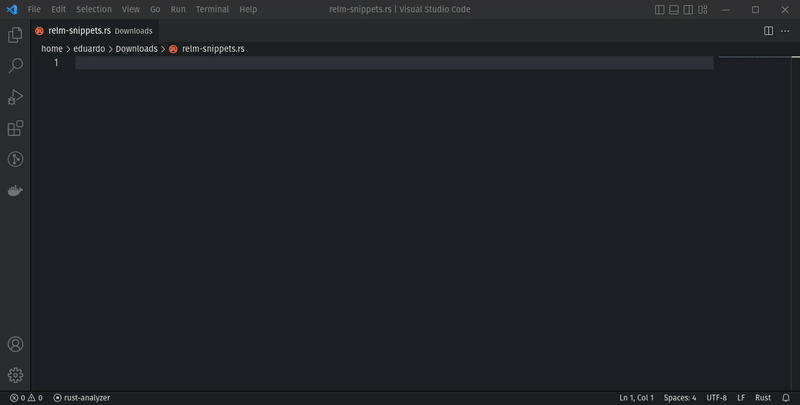

After more than one year of development, Relm4 0.5 has finally made it across the finish line with plenty of new features and improvements!
Without a doubt, version 0.5 is by far our largest release so far making Relm4 even easier, more stable and productive than before.

We can't fit all the improvements into this post so we'll only have a look at the most important new features added since the [first beta release](https://relm4.org/blog/posts/announcing_relm4_v0.5_beta).
Check out the [full changelog](https://github.com/Relm4/Relm4/blob/main/CHANGES.md) for more information.

> ## About Relm4
> 
> Relm4 is an idiomatic GUI library inspired by [Elm](https://elm-lang.org/) and based on [gtk4-rs](https://crates.io/crates/gtk4).
> 
> We believe that GUI development should be easy, productive and delightful.  
> The [gtk4-rs](https://crates.io/crates/gtk4) crate already provides everything you need to write modern, beautiful and cross-platform applications.
> Built on top of this foundation, Relm4 makes developing more idiomatic, simpler and faster and enables you to become productive in just a few hours.

## Async everything

The first beta release of Relm4 v0.5 brought [commands](/blog/posts/announcing_relm4_v0.5_beta/#commands) as a concept from Elm, which made asynchronous code very easy to integrate.
Since then, we've further extended async support, making it possible to use async from almost anywhere in Relm4.
This fully unlocks the great potential of Rust's async ecosystem and makes common tasks like interacting with network APIs a breeze.

In particular, asynchronous initialization of components greatly simplifies state management.
Instead of immediately returning a model in an uninitialized state, you can fetch all the resources you need and eventually return a fully initialized model.
On top of that, Relm4 allows you to show placeholder widgets while the model is being initialized.

```rust
// Placeholder until `init_model` completes
fn init_loading_widgets(root: &mut Self::Root) -> Option<LoadingWidgets> {
    view! {
        #[local_ref]
        root {
            set_orientation: gtk::Orientation::Horizontal,
            set_spacing: 10,

            gtk::Spinner {
                set_spinning: true,
                set_hexpand: true,
                set_halign: gtk::Align::Center,
                // Reserve vertical space
                set_height_request: 34,
            }
        }
    }
    Some(LoadingWidgets::new(root, spinner))
}

// ...

// Async initialization
async fn init_model(
    value: Self::Init,
    _index: &DynamicIndex,
    _sender: AsyncFactorySender<Self>,
) -> Self {
    // Asynchronously fetch data, sync information, etc.
    tokio::time::sleep(Duration::from_secs(1)).await;
    Self { value }
}
```

<video controls style="width: 100%;">
    <source src="./async_factory.webm" type="video/webm">
    Your browser does not support the video tag.
</video> 

## Widget templates

Often, similar widgets and properties are used multiple times in the same application or even across different applications.
With widget templates, you can define common UI elements as templates and reuse them easily.

```rust
#[relm4::widget_template]
impl WidgetTemplate for MyBox {
    view! {
        gtk::Box {
            set_margin_all: 10,
            inline_css: "border: 2px solid blue",
            gtk::Label {
                set_content: "My custom box template!",
            }
        }
    }
}
```

Using the template just requires the `#[template]` attribute in the macro.

```rust
#[relm4::component]
impl SimpleComponent for AppModel {
    type Init = u8;
    type Input = AppMsg;
    type Output = ();

    view! {
        gtk::Window {
            set_title: Some("Widget template"),

            // Using is my template
            #[template]
            MyBox {
                // We can still add additional children to out template!
                gtk::Label {
                    #[watch]
                    set_label: &format!("Counter: {}", model.counter),
                },
            },
        }
    }
    
    // ...
}
```

You can find more details in [this PR](https://github.com/Relm4/Relm4/pull/310).

## Macro improvements

Sending messages from simple signal handlers has become a bit easier.
Similar to the syntax of the [relm crate](https://github.com/antoyo/relm#widget-attribute), you can now send input messages with an arrow followed by the message.

```rust
gtk::Button {
    set_label: "Increment",
    connect_clicked => AppMsg::Increment,
}
```

## Tooling additions

Recently, we published [Relm4 snippets](https://github.com/Relm4/vscode-relm4-snippets) as an IDE extension that provides helpful snippets for implementing Relm4's traits.
This should help you saving some time while implementing common traits so you can fully focus on coding.
The extension is available on the [Visual Studio Marketplace](https://marketplace.visualstudio.com/items?itemName=Relm4.relm4-snippets) and [OpenVSIX](https://marketplace.visualstudio.com/items?itemName=Relm4.relm4-snippets).



## Other improvements

- Port relm4-components to 0.5
- Port the book to 0.5
- Move from custom documentation builds to [docs.rs](https://docs.rs/relm4/)
- Add `MessageBroker` to allow communication between components at different levels
- Add `Reducer` as message based alternative to `SharedState`
- Lots of other improvements and fixes

## On the horizon

Some tools haven't made it into this stable release but will follow soon.

+ [relm4-format](https://github.com/Relm4/Relm4/pull/385) is a tool that can format code inside the `view` macro to address the shortcomings of `rustfmt` regarding macros.
+ relm4-cli is a planned client for developing Relm4 application that will make project setup, build system configuration and cross-compilation easy.

If you want to support the our team working on these projects, please consider supporting [Eduardo Flores](https://github.com/sponsors/edfloreshz).

## Where to get started

+ ⬆️ **[Migration guide](https://relm4.org/book/stable/0_4_to_0_5.html)**
+ 🏠 **[Website](https://relm4.org)**
+ ⭐ **[Repository](https://github.com/Relm4/Relm4)**
+ 📖 **[Book](https://relm4.org/book/stable)**
+ 📜 **[Rust documentation](https://docs.rs/relm4)**
+ 📨 **[Chat room](https://matrix.to/#/#relm4:matrix.org)**

# Special thanks

We highly appreciate feedback and contributions to Relm4.
In the name of all members of the Relm4 organization I thank those who helped with this release:

+ [Andy Russell](https://github.com/euclio) for his continuous effort to improve Relm4.
+ [Eduardo Flores](https://github.com/edfloreshz) for his longstanding contributions to Relm4 and his work on Relm4 snippets.
+ [Pentamassiv](https://github.com/pentamassiv) for working on Relm4 and gtk-rs to bring our docs to docs.rs.
+ [Maksym Shcherbak](https://github.com/MaksymShcherbak) for many improvements, especially to our examples.
+ [Tronta](https://github.com/tronta) for contributing many book improvements.
+ [Sashin Exists](https://github.com/sashinexists) for implementing several useful methods for `FactoryVecDeque`.
+ Everyone else who contributed or gave feedback.
+ The whole gtk-rs team for providing awesome Rust bindings for GTK.
